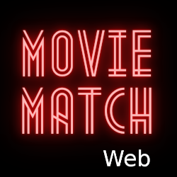

### Find a movie to watch together 📽️❤️

## 🤔 What is this?
A website to help couples or groups to choose a movie to watch
- React web app
- Retrieves data from the Movie Match API

## 📝 Project
- [Impact Map](https://github.com/DanielRobinsonSoftware?tab=projects)
- [Kanban board](https://github.com/users/DanielRobinsonSoftware/projects/1)

## 🤷 Motivation
This is a non-profit, solo project for fun and practice.

## 👏 Attribution
The projector emoji used in the favicon and logos was designed by <a href="https://openmoji.org/" rel="nofollow">OpenMoji</a> – the open-source emoji and icon project. License: <a href="https://creativecommons.org/licenses/by-sa/4.0/#" rel="nofollow">CC BY-SA 4.0</a>
